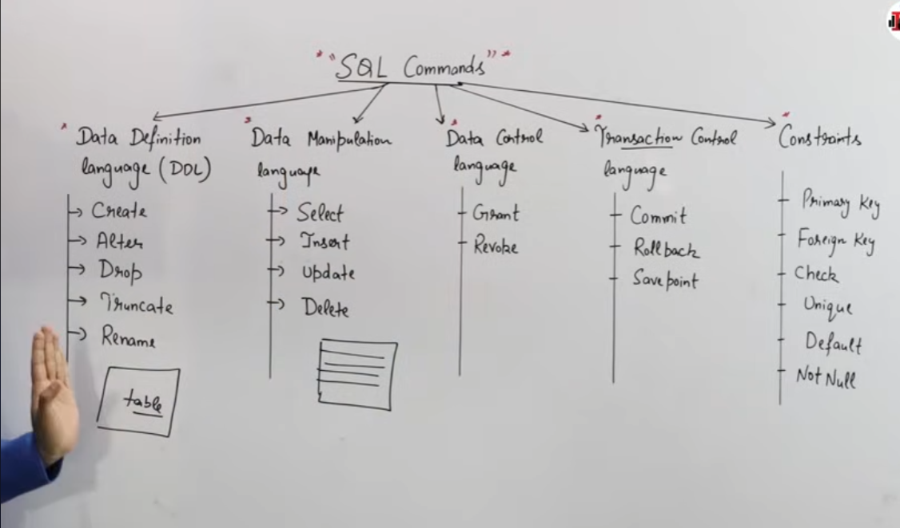

# Inroduction to Structured Query Language(Only Imp)

## Some useful points
- SQL is a **domain specific** lanuguage(as only applicable to relational queury langs).
- SQL is a **declarative** language.
- There are concepts like `keys` and `constraints`
- **Operators** are there( i.e `like` , `between`, `in`, `not in`, `conditionals` etc).
- **Clauses** are there(i.e `order by` , `group by`, `having`, `from`, `distinct` etc).
- **Aggregate** functions are there( e.g `sum()`, `avg()` etc).
- **Joins** and **Nested Queries**
- PL SQL nothing but procedural sql where we also need to define `how to do` along with *what to do*.

## Brief History

A scientist named ***EF Codd*** first came up with the concept of relational databases and gave his papers and after that in `1970` ***IBM*** first came up with sql databases.

## Different Types of Commands in SQL
